# Web selfservice app for changing local DB password for Aruba Clearpass
## Table of contents
* [General info](#general-info)
* [Setup](#setup)
* [Tests](#tests)
* [Usage](#usage)
* [License](#license)
* [Other Information](#other-infirmation)


## General info
Python Flask application which permits Aruba Clearpass local DB users to change their passwords through API calls
without Clearpass administrator intervention
	
## Setup
1. Install python and app's required dependencies.
2. Copy project files.
3. Rename example configuration files config/params_1_example.cfg and config/params_2_example.cfg to config/params_1.cfg and config/params_2.cfg
4. Fill in configuration to these files according to your Clearpass settings
### Params_1 Example
```
### Configuration File for Clearpass Change Password (local users)
### Passwords are stored in the different file

[ClearPass]
# IP or FQDN of the Clearpass Publisher
clearpass_fqdn = 10.12.102.7

[OAuth2]
# API connection parameters
grant_type = password
# client_id required for all grant types
client_id_rw = Sber_API_client
client_id_ro = Sber_API_client_RO
# Clearpass username for changing password through API
username = Sber_tech_api_admin

[DB]
# Clearpass username for database connection
username = appexternal

[Misc]
# Days to password expire (TODO:read this value from Clearpass)
days_to_passw_exp = 40
```
### Clearpass settings
* External DB user and password (CPPM)
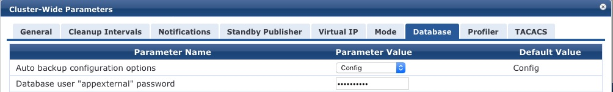
* Two API clients (Clearpass Guest)
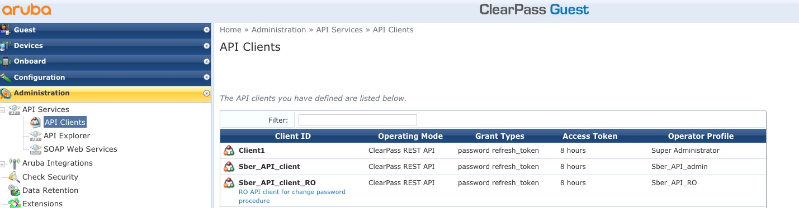
* RW API Client (Clearpass Guest)
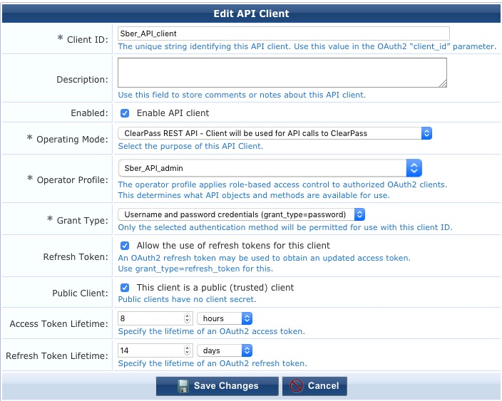
* RO API Client (Clearpass Guest)
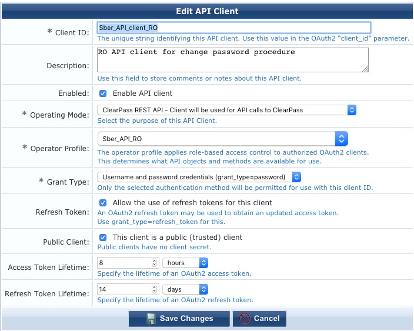
*Profiles for API clients (Clearpass Guest)
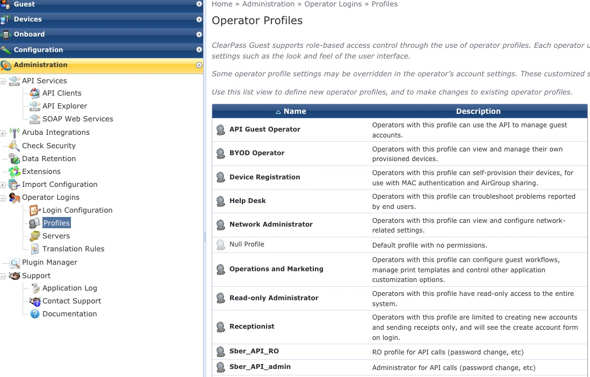
* RW profile (Clearpass Guest)
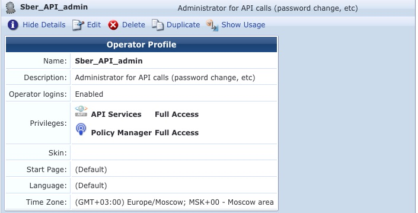
* RO profile (Clearpass Guest)
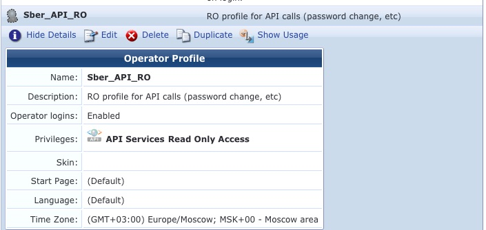
* Local user and Role for API RW (CPPM)
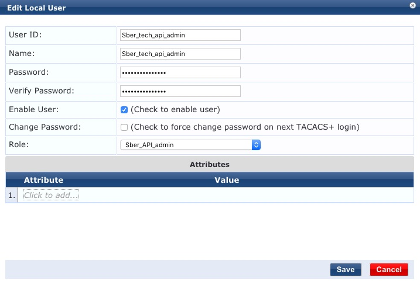
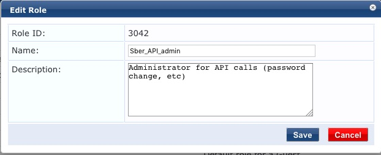

## Tests
Project directory contains integration tests (./tests/test_aaa.py):
1. Check file parameters
2. Ping CPPM
3. Test CPPM API connection
4. Test Postgress DB connection
5. Test password expiration for particular user (additional local user 'test_pass_expiry' required) 

Also test directory includes regression tests for developer (test_regression.py)
For this test the application must be started and user test123 must be existed.

### Testing
Run tests from project dir:
```
pytest -v test_aaa.py
```
Example of successful test results:
```
======================================================== test session starts =========================================================
platform darwin -- Python 3.7.1, pytest-5.3.4, py-1.7.0, pluggy-0.13.1 -- /anaconda3/bin/python
cachedir: .pytest_cache
rootdir: /Users/semenov-ay/Downloads/aaa-sber/CPPM-change-password, inifile: pytest.ini
plugins: doctestplus-0.2.0, arraydiff-0.3, remotedata-0.3.1, allure-pytest-2.8.7, openfiles-0.3.1
collected 15 items                                                                                                                   

tests/test_aaa.py::test_file1_parameters[ClearPass-clearpass_fqdn] PASSED                                                      [  6%]
tests/test_aaa.py::test_file1_parameters[OAuth2-grant_type] PASSED                                                             [ 13%]
tests/test_aaa.py::test_file1_parameters[OAuth2-client_id_rw] PASSED                                                           [ 20%]
tests/test_aaa.py::test_file1_parameters[OAuth2-client_id_ro] PASSED                                                           [ 26%]
tests/test_aaa.py::test_file1_parameters[OAuth2-username] PASSED                                                               [ 33%]
tests/test_aaa.py::test_file1_parameters[DB-username] PASSED                                                                   [ 40%]
tests/test_aaa.py::test_file1_parameters[Misc-days_to_passw_exp] PASSED                                                        [ 46%]
tests/test_aaa.py::test_file2_parameters[OAuth2-password] PASSED                                                               [ 53%]
tests/test_aaa.py::test_file2_parameters[DB-password] PASSED                                                                   [ 60%]
tests/test_aaa.py::test_cppm_ping PASSED                                                                                       [ 66%]
tests/test_aaa.py::test_clearpass_api_connection PASSED                                                                        [ 73%]
tests/test_aaa.py::test_clearpass_postgres_conn[right_pass] PASSED                                                             [ 80%]
tests/test_aaa.py::test_clearpass_postgres_conn[wrong_pass] PASSED                                                             [ 86%]
tests/test_aaa.py::test_clearpass_postgres_conn[wrong_name] PASSED                                                             [ 93%]
tests/test_aaa.py::test_exp_days_f PASSED                                                                                      [100%]

========================================================== warnings summary ==========================================================
tests/test_aaa.py::test_clearpass_api_connection
  /anaconda3/lib/python3.7/site-packages/urllib3/connectionpool.py:847: InsecureRequestWarning: Unverified HTTPS request is being made. Adding certificate verification is strongly advised. See: https://urllib3.readthedocs.io/en/latest/advanced-usage.html#ssl-warnings
    InsecureRequestWarning)

-- Docs: https://docs.pytest.org/en/latest/warnings.html
=================================================== 15 passed, 1 warning in 8.85s ====================================================semenoc
```

## Usage

Start application from project dir
```
python3 aaa_change_password.py 
```
Please use gunicorn + nginx to avoid security issues with HTTP

Connect to app by http//application_server_IP_address:5000
(if you are not using WSGI scheme)
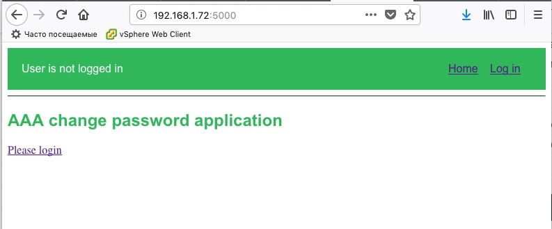
Login to App by your CPPM local username
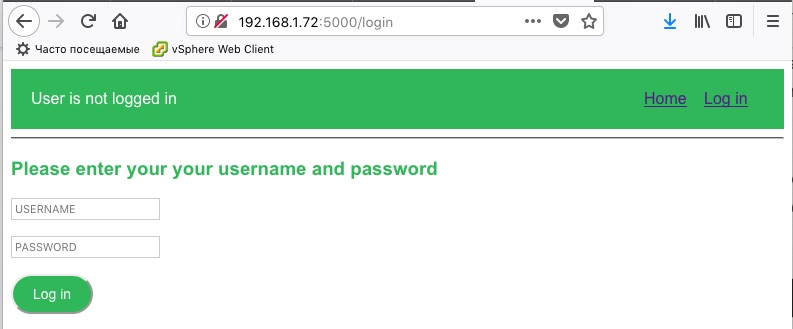
Logged_in page which shows expiration message (May differ from screenshot)
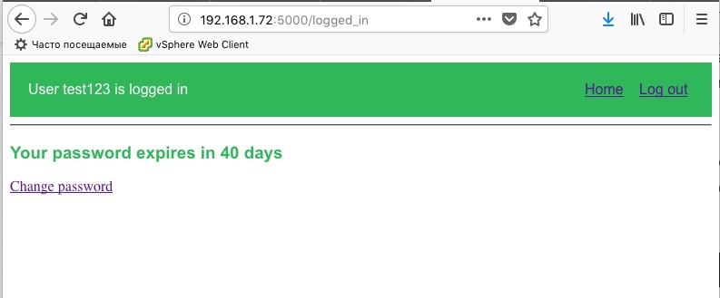
Change password page

Success in changing password redirects to Logged_in page

##License
MIT

## Other information
Author: Andrey Semenov andrey.semenov@hpe.com

## Roadmap
1. Add Gunicorn, nginx and Docker to Setup and Usage